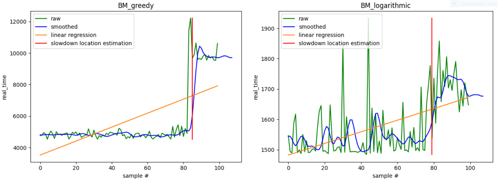

# Automated performance monitoring (C++ / Google benchmark)

[Click this link to see a more general guide on performance engineering I'm maintaining (work in progress)](https://github.com/bensanmorris/practical_performance)

A small utility that looks for step changes (slowdowns) in your google benchmark run history. It produces a report (**index.html**) containing a chart for each benchmark with a slowdown indicator indicating where a step-change (slowdown) in performance occurred. Simply accumulate your google benchmark run history and then run the benchmark_monitor_utility:

**IMPORTANT - benchmark history charts are generated by default however step change detection has to be explicitly requested via the new ```-sc``` command line option** 

```
benchmark_monitor.py -d [your_google_benchmark_performance_history_directory] -sc
```

An example that generates charts accross the real_time metric (with step change analysis):

```
benchmark_monitor.py -d [your_google_benchmark_performance_history_directory] -sc -m real_time
```

An example that generates charts accross both real_time and cpu_time metrics (with step change analysis):

```
benchmark_monitor.py -d [your_google_benchmark_performance_history_directory] -sc -m real_time cpu_time
```

The main challenge with automating performance monitoring is the variation in performance of the same code on the same machine accross subsequent runs. It isn't sufficient to compare a run of the benchmarks against a baseline (generated from a previous run) and then comparing the difference against a threshold owing to the variation. This utility instead looks for step changes in the performance of a set of benchmarks in relation to a history of prior runs of the benchmarks (on the same machine). 


A sample report:



[Click here to jump to the step-by-step demo below.](https://github.com/bensanmorris/benchmark_monitor#demo-steps-windows)

# The algorithm

This utility follows the **sliding window** approach described [here](https://en.wikipedia.org/wiki/Step_detection#Sliding_window) with variations. In summary:

1. Apply a filter to the benchmark results history (this smoothes out spikes and troughs when running benchmarks owing to intermittent background machine activity but doesn't eliminate step changes in performance)
2. Perform a statistical test on the benchmark history (comparing the sliding window of recent builds against the build history) to determine if there's a step change in prformance (slowdown)
3. Estimate the location of the step change

# The utility (benchmark_monitor.py)

A small python utility (benchmark_monitor.py) is provided to assist in identifying step changes (using the above approach). Run it over a directory containing your **benchmark performance history** (benchmark performance history = google benchmark json output) to generate an **index.html report** displaying your benchmark's performance along with a graphical step (slowdown) estimation indicator:

```
usage: benchmark_monitor.py [-h] [-d DIRECTORY] [-w SLIDINGWINDOW]
                            [-s MAXSAMPLES] [-f MEDIANFILTER] [-a ALPHAVALUE]
                            [-c CONTROLBENCHMARKNAME] [-x DISCARD]
                            [-sx STARTINDEX] [-ex ENDINDEX] [-m METRIC]
                            [-o OUTPUTDIRECTORY] [-sc]

Generates a chart for each google benchmark across a benchmark history with
optional step change detection.

optional arguments:
  -h, --help            show this help message and exit
  -d DIRECTORY, --directory DIRECTORY
                        Directory containing benchmark result json files to
                        process
  -w SLIDINGWINDOW, --slidingwindow SLIDINGWINDOW
                        The size of the benchmark comparison sliding window
  -s MAXSAMPLES, --maxsamples MAXSAMPLES
                        The maximum number of benchmarks (including
                        slidingwindow) to run analysis on (0 == all builds)
  -f MEDIANFILTER, --medianfilter MEDIANFILTER
                        The median filter kernel size i.e. the number of
                        points around each data value to smooth accross in
                        order to eliminate temporary peaks and troughs in
                        benchmark performance
  -a ALPHAVALUE, --alphavalue ALPHAVALUE
                        The alpha value at which we reject the hypothesis that
                        the sliding window of benchmarks equals the benchmark
                        history. Typical value is around 0.05 to 0.01. The
                        noisier the environment the lower this value should
                        be.
  -c CONTROLBENCHMARKNAME, --controlbenchmarkname CONTROLBENCHMARKNAME
                        The control benchmark name (not yet implemented)
  -x DISCARD, --discard DISCARD
                        (DEBUG) The number of (most recent) records to ignore.
                        This is useful when wanting to debug scenarios in a
                        sub region of the history
  -sx STARTINDEX, --startindex STARTINDEX
                        (DEBUG - Alternative addressing scheme) The index to
                        start the analysis at
  -ex ENDINDEX, --endindex ENDINDEX
                        (DEBUG - Alternative addressing scheme) The index to
                        end the analysis at
  -m METRIC, --metric METRIC
                        The benchmark metric(s) to track 
  -o OUTPUTDIRECTORY, --outputdirectory OUTPUTDIRECTORY
                        The index.html report output directory
  -sc, --detectstepchanges
                        Detect step changes

```

**Customising the report:**

The report is formatted using the Jinja2 template library. The report's template can be found in the **templates** directory.

## Demo overview:

Demo prerequisites:

- [Python 3.7.4](https://www.python.org/downloads/release/python-374/)
- [CMake](https://cmake.org/download/) - needs to be on your PATH (it will be if you're on Windows and use the installer)
- [Visual Studio 2019](https://visualstudio.microsoft.com/vs/older-downloads/)

The format of this step by step demo:

1. Create a fictitious software product (our product being 2 solutions to the maximum sub array problem)
2. Define benchmarks for our product (2 solutions to the maximum sub array problem so two corresponding benchmarks)
3. Simulate a benchmark history (we will generate 30 executions of the benchmarks)
4. Modify the code introducing a slowdown
5. Run the benchmark analysis (and generate a report - hopefully with a step change (as in slow-down) indicator as to where the slow down occurred)

## Demo steps (Windows):

clone this repo and cd into it:
```
git clone https://github.com/bensanmorris/benchmark_monitor.git
cd benchmark_monitor
```

Install Python's virtualenv module, create a python virtual environment, activate it and install required packages:
```
(These instructions are for python3.7.4)
py -3.7 -m venv env
env\Scripts\activate
pip install -r requirements.txt
```

generate build files for VS 2019:
```
cmake -B build -G "Visual Studio 16 2019" -A x64 .
```

build the demo:
```
cd build
cmake --build . --config Release
```

next, run the line below (it will simulate 50 benchmark runs, each time running and outputting the benchmark results to a separate file to simulate a benchmark run history). After each run, an analysis (benchmark_monitor.py) is performed to see if the benchmark results indicate a slowdown.

NB. In the run below we will generate charts for the following metrics:

- real_time - a google benchmark metric
- MaxProcPhysMem - a custom metric of mine that tracks process physical memory 

```
(in a windows cmd prompt)
for /L %a in (1,1,50) Do Release\max_sub_array.exe --benchmark_out=%aresults.json && ..\benchmark_monitor.py -d . -w 6 -a 0.01 -sc -m real_time MaxProcPhysMem
```

**nb. You can tune the analysis by decreasing the alpha value (the default is 0.05) ie. the noisier the environment is the lower the alpha value should be i.e. above I've assumed a relatively noisy machine so set the alpha value to 0.01**

benchmark_monitor.py will report `BENCHMARK [benchmark_name] STEP CHANGE IN PERFORMANCE ENCOUNTERED` for each benchmark that appears to have a consistent step change in its performance when comparing the "recent builds window" (the -b parameter to benchmark_monitor that indicates the size of the recent build window which, in the case above is set to 6). 

next, let's introduce a slow down in the code, to do this, open main.cpp and uncomment the line beneath the `// UNCOMMENT THIS` comment

re-build (the now slower code):
```
cmake --build . --config Release
```

next, perform 20 more runs of the benchmark and, after each build, run an analysis to see if the benchmark results indicate a slowdown:
```
(in a windows cmd prompt)
for /L %a in (51,1,70) Do Release\max_sub_array.exe --benchmark_out=%aresults.json && ..\benchmark_monitor.py -d . -w 6 -sc -m real_time MaxProcPhysMem
```

**Finally, open index.html and inspect. Nb. you can simulate a noisy environment by re-running the experiment whilst performing other tasks on your machine. If you do this then you should decrease the alpha value as described above.**

# Improvements (Future Work)

1. Potentially use a control benchmark (the code for which doesn't change) that runs in parallel with each benchmark (and that generates a benchmark specific counter) to help normalise (scale) a benchmark's metrics relative to the control benchmark counter to help reduce the effect of machine noise (speedup / slowdown).
2. Explore ["Core clock cycles"](https://software.intel.com/content/www/us/en/develop/articles/intel-performance-counter-monitor.html) - described by Agner Fogg and available on Intel CPUs that appear independent of the clock frequency (which can vary depending on load).

# Tip Jar / Patreon

If you find this project useful and want to buy me a coffee then you can do so via my itch.io page by [downloading my free software and making a donation as part of that process here](https://benmorris.itch.io/plugin-based-scene-editor). Alternatively if you want to keep this code monkey in bananas then you can [support me over on Patreon, thanks!](https://www.patreon.com/SimulationStarterKit)
